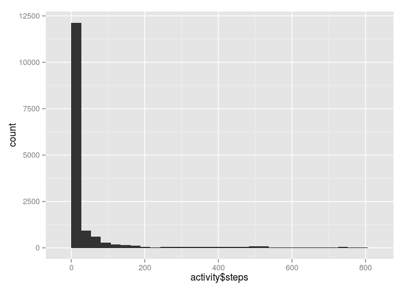
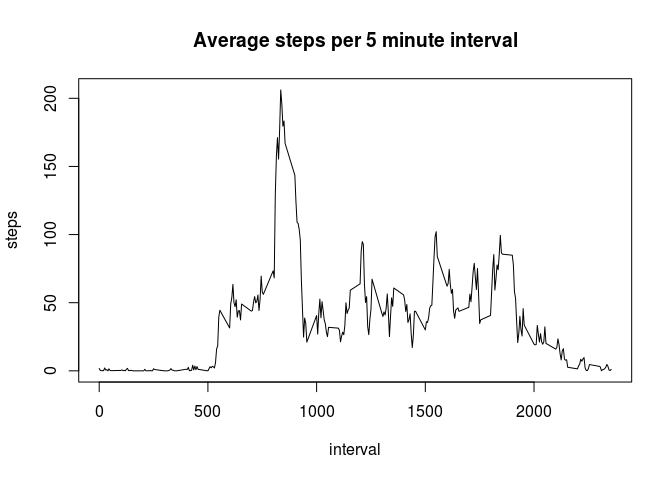
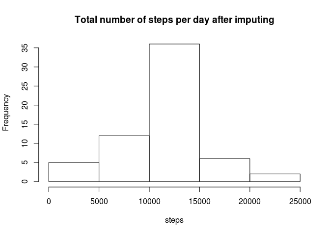
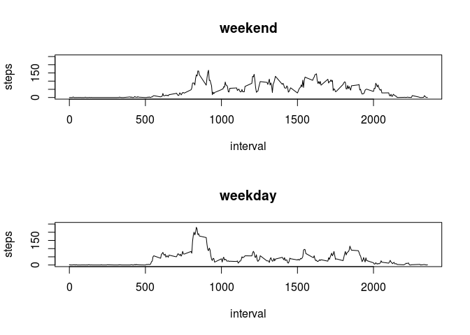

# Reproducible Research: Peer Assessment 1


## Loading and preprocessing the data


```r
activity <- read.csv('activity.csv')
```


## What is mean total number of steps taken per day?

Calculate total number of daily steps by adding the steps of all 5 minute intervals in a day. Plot a histogram of this total number of steps.

```r
dailySteps <- tapply(activity$steps, activity$date, sum, simplify=TRUE)
hist(dailySteps, main="Total number of steps per day", xlab="steps")
```

 

The mean and median number of steps are calculated, after removing the missing values.

```r
mean(dailySteps, na.rm = TRUE)
```

```
## [1] 10766.19
```

```r
median(dailySteps, na.rm = TRUE)
```

```
## [1] 10765
```


## What is the average daily activity pattern?

Calculate mean of number of steps for each 5 minute interval, averaged over all days.

```r
intervalSteps <- tapply(activity$steps, activity$interval, mean, na.rm = TRUE, simplify=TRUE)
interval <- unique(activity$interval)
plot(interval, intervalSteps, type='l', main='Average steps per 5 minute interval', ylab="steps")
```

 

Find largest value and its index, then find the corresponding interval.

```r
maxsteps <- max(intervalSteps, na.rm = TRUE)
maxinterval<- names(intervalSteps)[intervalSteps==maxsteps]
cat("Interval", maxinterval, "has the largest average number of steps:", maxsteps, "\n")
```

```
## Interval 835 has the largest average number of steps: 206.1698
```

## Imputing missing values

Impute missing values with average number of steps of that interval over all days (as calculated above).


```r
na_values <- length(activity$steps[is.na(activity$steps)])
cat("Total number of rows with missing values for steps is",na_values, "out of a total of",length(activity$steps), "measurements.")
```

```
## Total number of rows with missing values for steps is 2304 out of a total of 17568 measurements.
```

Impute missing values with average number of steps of that interval over all days (as calculated above).


```r
activity2 <- activity # create new dataset, initially identical to old one
for(i in 1:nrow(activity)) { # loop over rows of original dataset
    row <- activity[i,]
    if( is.na(row[,1]) ){ # if number of steps is NA
      ival = row[,3] # interval value
      iival = which(interval==ival) # interval index in the vector of means per interval
      activity2[i,1] <- intervalSteps[iival] # actual imputing of values
    }
}
```

Re-calculate total number of steps per day and redo histogram using the imputed dataset.

```r
dailySteps2 <- tapply(activity2$steps, activity2$date, sum, simplify=TRUE)
hist(dailySteps2, main="Total number of steps per day after imputing", xlab="steps")
```

 

The mean and median number of steps after imputing

```r
mean(dailySteps2, na.rm = TRUE) # na.rm=TRUE actually not needed anymore
```

```
## [1] 10766.19
```

```r
median(dailySteps2, na.rm = TRUE)
```

```
## [1] 10766.19
```
The mean and the median after imputing do not change much from the ones we calculated before imputing.

## Are there differences in activity patterns between weekdays and weekends?

First convert days to weekdays, then to two factors. Add those factors to the data set.


```r
what_day <- weekdays(as.Date(activity2$date))
what_day[what_day=="Sunday" | what_day=="Saturday"] = "Weekend"
what_day[what_day!="Weekend"] = "Weekday"
activity2$day <- what_day
#
intervalStepsWeekend <- tapply(activity2$steps[activity2$day=="Weekend"], activity2$interval[activity2$day=="Weekend"], mean, na.rm = TRUE, simplify=TRUE)
intervalStepsWeekday <- tapply(activity2$steps[activity2$day=="Weekday"], activity2$interval[activity2$day=="Weekday"], mean, na.rm = TRUE, simplify=TRUE)

par(mfrow=c(2,1))
plot(interval, intervalStepsWeekend, type='l', main='weekend', ylab="steps", ylim=c(0.,250.))
plot(interval, intervalStepsWeekday, type='l', main='weekday', ylab="steps", ylim=c(0.,250.))
```

 

The activity patterns change significantly between weekends and weekdays. This is to be expected due to the change on the average sleeping times and general daily activities of people on weekends as compared to the week days.
