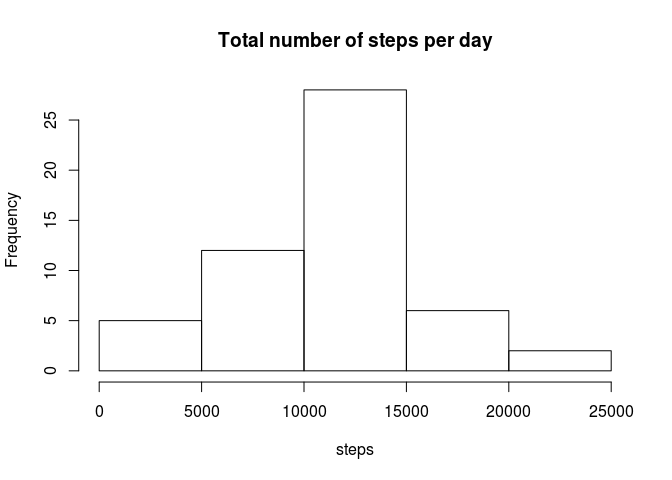

# Reproducible Research: Peer Assessment 1


## Loading and preprocessing the data


```r
activity <- read.csv('activity.csv')
```


## What is mean total number of steps taken per day?

Calculate total number of daily steps by adding the steps of all 5 minute intervals in a day. Plot a histogram of this total number of steps.

```r
dailySteps <- tapply(activity$steps, activity$date, sum, simplify=TRUE)
hist(dailySteps, main="Total number of steps per day", xlab="steps")
```

 

The mean and median number of steps are calculated, after removing the missing values.

```r
mean(dailySteps, na.rm = TRUE)
```

```
## [1] 10766.19
```

```r
median(dailySteps, na.rm = TRUE)
```

```
## [1] 10765
```


## What is the average daily activity pattern?

Calculate mean of number of steps for each 5 minute interval, averaged over all days.

```r
intervalSteps <- tapply(activity$steps, activity$interval, mean, na.rm = TRUE, simplify=TRUE)
interval <- unique(activity$interval)
plot(interval, intervalSteps, type='l', main='Average steps per 5 minute interval', ylab="steps")
```

 

Find largest value and its index, then find the corresponding interval.

```r
maxsteps <- max(intervalSteps, na.rm = TRUE)
maxinterval<- names(intervalSteps)[intervalSteps==maxsteps]
cat("Interval", maxinterval, "has the largest average number of steps:", maxsteps, "\n")
```

```
## Interval 835 has the largest average number of steps: 206.1698
```

## Imputing missing values

Impute missing values with average number of steps of that interval over all days (as calculated above).


```r
na_values <- length(activity$steps[is.na(activity$steps)])
cat("Total number of rows with missing values for steps is",na_values, "out of a total of",length(activity$steps), "measurements.")
```

```
## Total number of rows with missing values for steps is 2304 out of a total of 17568 measurements.
```

Impute missing values with average number of steps of that interval over all days (as calculated above).


```r
activity2 <- activity # create new dataset, initially identical to old one
for(i in 1:nrow(activity)) { # loop over rows of original dataset
    row <- activity[i,]
    if( is.na(row[,1]) ){ # if number of steps is NA
      ival = row[,3] # interval value
      iival = which(interval==ival) # interval index in the vector of means per interval
      activity2[i,1] <- intervalSteps[iival] # actual imputing of values
    }
}
```


## Are there differences in activity patterns between weekdays and weekends?
